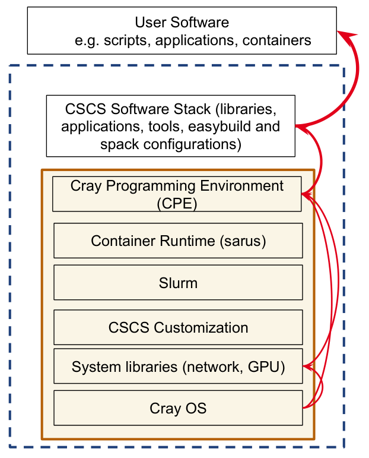
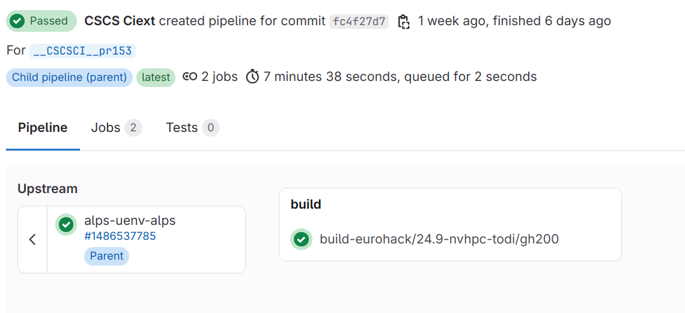

# UENV: CSCS approach to deploy user environments and scientific applications
<!--  -->
<!-- _paginate: skip  -->
<!-- _class: titlecover -->
<!-- _footer: "" -->

---
# CPE: The Cray Programming Environment
HPE/Cray provides a programming environment that is familiar to all users:
- Daint XC: Cray Development Toolkit (CDT)
- Alps - Cray Programming Environment (CPE)

On Alps it is installed in `/opt/cray`
- RPMs installed via zypper
  - CSCS can choose which RPMs to install, but can't modify them easily
- Changes require rebuilding the node image and rebooting nodes
- New release every 3 months

Users configure the environment using modules.

**CSCS will no longer provide software built using CPE for users**

---
# Providing software via CPE

<div class="twocolumns">
<div>
The Cray Programming Environment is complex by necessity:

- Modules provide a combinatorial set of libraries and tools that serve as many use cases as possible
- Integration is provided by HPE: once an issue is identified HPE have to fix the issue in a future release
  - long latency between issue reporting and the fix
- Each new release requires extensive testing to check that the issues have been fixed
  - And to identify the inevatible new issues
- CSCS will no longer provide software built using CPE for users
</div>

<div>

</div>
</div>

---

# A UENV is a self-contained software stack

A uenv is two components:

1. A squashfs file
   - "a read-only file system that lets you compress whole file systems or single directories, to write them to ordinary files, and then mount them using a loopback device"
   - A single file that contains everything in a working environment
2. Meta data
   - information about the uenv build (when, where, who)
   - the recipe that was used to build
   - information about the contents of the uenv
   - **environment configurations**

External dependencies:
- `libfabric` and `xpmem`: network libraries
- slurm

---
# Mounting a squashfs image

Setuid binary `squashfs-mount`, slurm-uenv-mount plugin (executed as root in remote context)

1. Unshare linux mount namespace
2. Mount the squashfs image (under `/user-environment`)
3. Return to unprivileged user


---
# UENV mount points

- `/user-environment`
  - Programming Environments
    - Compilers, MPI, libraries (e.g.: HDF5, FFTW, BLAS
  - Application environments
    - CP2k, GROMCAS, QE, etc ..

---
# A UENV has to be available on $SCRATCH filesystem to be used

Store in repository, which is a directory with:
- A database: **index.db**
- A hashed path for each uenv that contains
  - the squashfs image **store.squashfs**
  - meta data: **env.json**

```bash
uenv image find quantumespresso
uenv image pull quantumespresso/v7.3.1:v2
```

---
# UENV command-line utility

```bash
uenv run quantumespresso --view=default -- pw.x < pw.in
```


```bash
uenv start quantumespresso --view=develop
```

-> `uenv start` launches a new bash instance
```
[eiger][simonpi@eiger-ln002 ~]$ uenv start prgenv-gnu --view=spack
loading the view prgenv-gnu:develop
[eiger][simonpi@eiger-ln002 ~]$ ps
   PID TTY          TIME CMD
180119 pts/1    00:00:00 bash
182275 pts/1    00:00:00 bash
182343 pts/1    00:00:00 ps
```

---
# SLURM plugin

[https://github.com/eth-cscs/uenv2](https://github.com/eth-cscs/uenv2)

```bash
srun --uenv=quantumespresso --view=default pw.x < pw.in
```

```bash
#SBATCH --uenv=quantumespresso --view=default
srun pw.x < pw.in
```

```bash
$ salloc --uenv=quantumespresso
$ echo "the uenv isn't mounted in the local context"
# the uenv will get mounted in srun
$ srun sh -c 'mount | grep /user-environment'
```


For interactive sessions
```
uenv start --view=default quantumespresso
srun pw.x < pw.in
```

`uenv start` sets environment variables which are recognized by the slurm plugin.

---
# UENV recipe

- Packages/views: `environments.yaml`
- Name, description, spack version: `config.yaml`
- lmod/tcl modules: `modules.yaml`
- Compilers: `compilers.yaml`


---
# UENV `environments.yaml`

<style scoped>
code {
    font-size: 20px;
}
</style>

```yaml
nvhpc-env:
  compiler:
    - toolchain: gcc
      spec: gcc@12
    - toolchain: llvm
      spec: nvhpc
  mpi:
    spec: cray-mpich@8.1.30%nvhpc
    gpu: cuda
  unify: true
  specs:
  - quantum-espresso@7.3.1 %nvhpc +libxc +cuda +nvtx +scalapack +openmp +mpigpu
  - netlib-scalapack
  - fftw%nvhpc
  - nvpl-blas threads=openmp
  - nvpl-lapack threads=openmp
  - libxc%nvhpc~cuda
  packages:
  - git
  variants:
  - +mpi
  - +cuda
  - cuda_arch=90
  views:
    default:
      link: roots
    develop:
      exclude: ['quantum-espresso', 'patchelf', 'git']
      link: roots
```


---
# Material science UENVs

- CP2K
- Gromacs
- QuantumESPRESSO
- SIRIUS
- NAMD
- VASP
- LAMMPS
- QE-SIRIUS

---
# Code compilation using modules

```bash
uenv start --view=modules quantumespresso/v7.3.1
module load cmake \
    fftw \
    nvhpc \
    nvpl-lapack \
    nvpl-blas \
    cray-mpich \
    netlib-scalapack \
    libxc

mkdir build && cd build
FC=mpif90 CXX=mpic++ CC=mpicc cmake .. \
    -DQE_ENABLE_MPI=ON \
    -DQE_ENABLE_OPENMP=ON \
    -DQE_ENABLE_SCALAPACK:BOOL=OFF \
    -DQE_ENABLE_LIBXC=ON \
    -DQE_ENABLE_CUDA=ON \
    -DQE_ENABLE_PROFILE_NVTX=ON \
    -DQE_CLOCK_SECONDS:BOOL=OFF \
    -DQE_ENABLE_MPI_GPU_AWARE:BOOL=OFF \
    -DQE_ENABLE_OPENACC=ON
make -j20
```

---
# Code compilation using spack

1. Load the base UENV and setup spack
```bash
uenv start --view=spack quantumespresso
. $SCRATCH/spack/share/spack/setup-env.sh

# clone and load spack and configuring the uenv as spack upstream
export SPACK_SYSTEM_CONFIG_PATH=$UENV_SPACK_CONFIG_PATH
git clone -b $UENV_SPACK_COMMIT $UENV_SPACK_URL $SCRATCH/spack
. $SCRATCH/spack/share/spack/setup-env.sh
```


2. Use an independent spack environment [https://spack.readthedocs.io/en/latest/environments.html#independent-environments](link)
```yaml
spack:
  specs:
  - quantumespresso%nvhpc +cuda build_type=Release
  develop:
    quantumespresso:
      path: /path/to/q-e/src
      spec: quantumespresso@develop
  packages:
    all:
      variants: cuda_arch=90
  view:
      default
```

# Build pipeline / CICD




---
# References
<div class="twocolumns">
<div>

- Knowledge Base [https://confluence.cscs.ch/display/KB/UENV+user+environments](https://confluence.cscs.ch/display/KB/UENV+user+environments)
- ALPS-uenv recipe repository [https://github.com/eth-cscs/alps-uenv](https://github.com/eth-cscs/alps-uenv)
- Stackinator [https://eth-cscs.github.io/stackinator/](https://eth-cscs.github.io/stackinator/)
- How to use spack with uenv [https://eth-cscs.github.io/alps-uenv/tutorial-spack/#using-uenvs-as-upstream-spack-instances](https://eth-cscs.github.io/alps-uenv/tutorial-spack/#using-uenvs-as-upstream-spack-instances)

</div>
<div>

</div>
</div>


